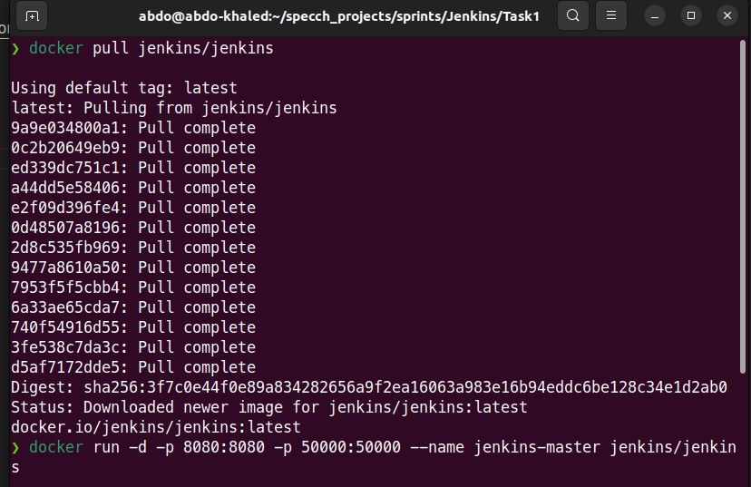

# Jenkins Task 1 
## 1- What is Jenkins used for?
### Jenkins is an open-source automation server that helps automate the software development process. It is used to build, test, and deploy software applications. Jenkins can be used to automate a variety of tasks so including:
- Building software from source code
- Running unit tests
- Integrating with continuous integration (CI) and continuous delivery (CD) tools
- Deploying software to production
- Monitoring software deployments
----------------------------------------------------------------
## 2- Install jenkins with docker image

-------------------------------------------------
## 3- what are plugins in jenkins ?
### Plugins in Jenkins are software extensions that can be used to add new features or functionality to Jenkins that help Jenkins automate the software development process and deploy software to production.
---------------------------------------------

